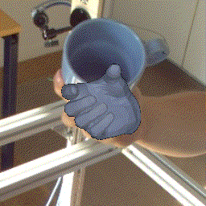
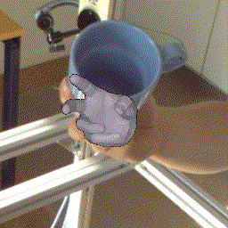

# TempCLR: Reconstructing Hands via Time-Coherent Contrastive Learning [3DV 2022]

[](https://eth-ait.github.io/tempclr)
[](http://arxiv.org/abs/2209.00489)

> [**TempCLR: Reconstructing Hands via Time-Coherent Contrastive Learning**](http://arxiv.org/abs/2209.00489),
> [Andrea Ziani*](https://www.linkedin.com/in/andrea-ziani/),
> [Zicong Fan*](https://ait.ethz.ch/people/zfan),
> [Muhammed Kocabas](https://ps.is.tuebingen.mpg.de/person/mkocabas),
> [Sammy Christen](https://ait.ethz.ch/people/sammyc/),
> [Otmar Hilliges](https://ait.ethz.ch/people/hilliges)
> *Equal Contribution.
> International Conference on 3D Vision (3DV), 2022

## Teaser

TempCLR:
<p align="center">
    
</p>

No TempCLR:
<p align="center">
    
</p>

## Updates

- Sept. 1, 2022: Project page and arXiv paper are online.
- Sept. 2, 2022: Code and model release is in progress.

## Citation

```
@inProceedings{ziani2022tempclr,
  title={TempCLR: Reconstructing Hands via Time-Coherent Contrastive Learning},
  author={Ziani, Andrea and Fan, Zicong and Kocabas, Muhammed and Christen, Sammy and Hilliges, Otmar},
  booktitle={International Conference on 3D Vision (3DV)},
  year={2022}
}
```