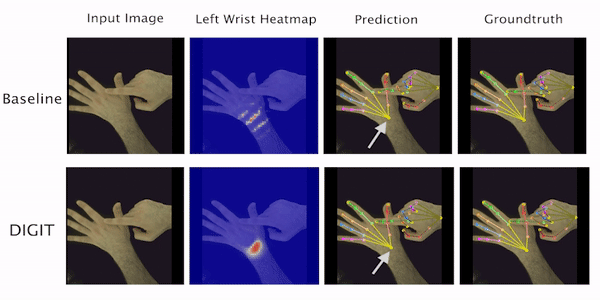

# TempCLR: Reconstructing Hands via Time-Coherent Contrastive Learning [3DV 2022]

[](https://eth-ait.github.io/tempclr)
[](http://arxiv.org/abs/2209.00489)

> [**TempCLR: Reconstructing Hands via Time-Coherent Contrastive Learning**](http://arxiv.org/abs/2209.00489),
> [Andrea Ziani*](https://www.linkedin.com/in/andrea-ziani/),
> [Zicong Fan*](https://ait.ethz.ch/people/zfan),
> [Muhammed Kocabas](https://ps.is.tuebingen.mpg.de/person/mkocabas),
> [Sammy Christen](https://ait.ethz.ch/people/sammyc/),
> [Otmar Hilliges](https://ait.ethz.ch/people/hilliges)
> *Equal Contribution.
> International Conference on 3D Vision (3DV), 2022


<p align="center">
    
</p>


> For training code, contact [Zicong Fan*](https://zc-alexfan.github.io/).


## Updates

- Sept. 28, 2022: Inference code and pre-trained model are ready.
- Sept. 1, 2022: Project page and arXiv paper are online.

# Table of contents
- [Download and setup pre-trained models](#download-and-setup-pre-trained-models)
- [Setup inference code](#setup-inference-code)
  * [Datasets](#datasets)
  * [Setup anaconda environment](#setup-anaconda-environment)
    + [Create the environment](#create-the-environment)
    + [Activate the environment](#activate-the-environment)
  * [Setup environment variables](#setup-environment-variables)
    + [Download utilities](#download-utilities)
    + [Download MANO models](#download-mano-models)
    + [Setup variables](#setup-variables)
  * [Config file utils](#config-file-utils)
- [Run inference code](#run-inference-code)
- [Acknowledgements](#acknowledgements)
- [Citations](#citations)

In case you encounter any issue following this README, please [Contact Us](mailto:aziani@student.ethz.ch,zicong.fan@inf.ethz.ch).

# Download our release models
Our release models can be downloaded at [this Dropbox](https://www.dropbox.com/sh/jmy2owz873nerw1/AAAHxG9YLJd91l5Ou5gsDvGBa?dl=0).

Once you downloaded our release zip file, extract it in the project directory. The final directory structure should look like:
```
TempCLR/
├── ...
TempCLR_release/
├── FreiHAND_model/
│   └── checkpoints/
│       ├── latest_checkpoint
│       └── tempclr_freihand
├── HO3D_model/
│   └── checkpoints/
│       ├── latest_checkpoint
│       └── tempclr_ho3d
├── LICENSE
└── TempCLR_utils/
    ├── data/
    │   ├── all_means.pkl
    │   └── shape_mean.npy
    └── models/
        └── mano/
            └── README
environment.yml
LICENCE
mano_left_extra_joints.yaml
mano_right_extra_joints.yaml            

```

# Setup inference code

## Datasets
The repository provides the code to perform inference on the [FreiHAND](https://lmb.informatik.uni-freiburg.de/resources/datasets/FreihandDataset.en.html) dataset and the [HO-3D_v2](https://www.tugraz.at/index.php?id=40231) dataset. 

In order to run the inference code, download the datasets first and extract them in the same directory. The resulting directory structure and directory names should look like:
```
datasets
├── freihand
└── HO3D_v2
```

## Setup anaconda environment 
This repository provides the recipe `tempclr-env.yaml` for a conda environment containing every dependency the code needs in order to work. 

If you have not installed anaconda in your device, install [Anaconda](https://www.anaconda.com/products/distribution) first and then come back to this guide.

### Create the environment 
To create the environment, open a shell in the TempCLR project directory and run this command:
```
conda env create -f environment.yml
```

Wait until the execution ends. If everything went well you should see a suggestion to activate `tempclr-env` .

### Activate the environment
To activate the environment run: 
```
conda activate tempclr-env
```

Great! The environment has been activated. Now that the environment has been set up proceed to the next section.

## Setup environment variables

### Download MANO models
Our project is based on MANO. Hence, MANO models are needed to correctly run this codebase. 
Before proceeding further, download MANO models (i.e. `MANO_RIGHT.pkl` and `MANO_LEFT.pkl`) from the [official website](https://mano.is.tue.mpg.de/index.html)
and place them inside `TempCLR_utils/models/mano` directory.

### Setup variables
In the shell where you will run the inference code, run the following commands:
```
export MODELS=<path_to_TempCLR_utils>/models
export MEAN_POSE_PATH=<path_to_TempCLR_utils>/data
export DATASETS=<path_to_the_datasets_directory>
export INFERENCE=<path_to_TempCLR_release>
```

# Run inference code
Once followed all the previous steps, open a shell in the TempCLR project with the conda environment and environment variables set and use the following command to run the inference code:
```
python TempCLR/main.py --exp-cfg TempCLR/configs/evaluation_freihand.yaml
```
for inference on FreiHAND, and 
```
python TempCLR/main.py --exp-cfg TempCLR/configs/evaluation_ho3d.yaml
```
for inference on HO-3D. 

Since the ground-truth labels of the test sets are hidden in CodaLab competitions (see [HO-3D](https://competitions.codalab.org/competitions/22485) and [FreiHAND](https://competitions.codalab.org/competitions/21238)), the code will save a `pred.json` file in the pre-trained model directory. 
This file contains the predictions on the test set to be uploaded on CodaLab. Zip the json file and upload it in the respective CodaLab competition to obtain the results for the different metrics reported in the paper.

# Config file utils
## Save inference re-projection images
To save the re-projection images produced by the pre-trained models set these two flags in the config file:
```
save_reproj_images: True
create_image_summaries: True
```

The images will be saved in the pre-trained model directory under a new directory named  `summary` .


# Projects that might interest you

**Learning to Disambiguate Strongly Interacting Hands via Probabilistic Per-Pixel Part Segmentation**
> Zicong Fan, Adrian Spurr, Muhammed Kocabas, Siyu Tang, Michael J. Black, Otmar Hilliges. 3DV2021. [[Project](https://zc-alexfan.github.io/digit)] 

<p align="center">
    
</p>

# Acknowledgements
[Muhammed Kocabas](https://ps.is.mpg.de/employees/mkocabas) is supported by the Max Planck ETH Center for Learning Systems. 
The authors would like to thank [Vassilis Choutas](https://ps.is.mpg.de/person/vchoutas) for providing the code of the baseline model ([ExPose](https://expose.is.tue.mpg.de/)) adopted for the project.

# Citations
If you find this work useful, consider citing:

```
@inProceedings{ziani2022tempclr,
  title={TempCLR: Reconstructing Hands via Time-Coherent Contrastive Learning},
  author={Ziani, Andrea and Fan, Zicong and Kocabas, Muhammed and Christen, Sammy and Hilliges, Otmar},
  booktitle={International Conference on 3D Vision (3DV)},
  year={2022}
}

@inproceedings{hampali2020honnotate,
  title={Honnotate: A method for 3d annotation of hand and object poses},
  author={Hampali, Shreyas and Rad, Mahdi and Oberweger, Markus and Lepetit, Vincent},
  booktitle={Proceedings of the IEEE/CVF conference on computer vision and pattern recognition},
  pages={3196--3206},
  year={2020}
}


@inproceedings{Freihand2019,
  author    = {Christian Zimmermann, Duygu Ceylan, Jimei Yang, Bryan Russell, Max Argus and Thomas Brox},
  title     = {FreiHAND: A Dataset for Markerless Capture of Hand Pose and Shape from Single RGB Images},
  booktitle = {IEEE International Conference on Computer Vision (ICCV)},
  year = {2019},
  url          = "https://lmb.informatik.uni-freiburg.de/projects/freihand/"
}

@inproceedings{ExPose:2020,
  title = {Monocular Expressive Body Regression through Body-Driven Attention},
  author = {Choutas, Vasileios and Pavlakos, Georgios and Bolkart, Timo and Tzionas, Dimitrios and Black, Michael J.},
  booktitle = {European Conference on Computer Vision (ECCV)},
  pages = {20--40},
  year = {2020},
  url = {https://expose.is.tue.mpg.de}
}

@article{MANO:SIGGRAPHASIA:2017,
    title = {Embodied Hands: Modeling and Capturing Hands and Bodies Together},
    author = {Romero, Javier and Tzionas, Dimitrios and Black, Michael J.},
    journal = {ACM Transactions on Graphics, (Proc. SIGGRAPH Asia)},
    volume = {36},
    number = {6},
    series = {245:1--245:17},
    month = nov,
    year = {2017},
    month_numeric = {11}
}
```
